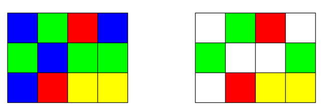

# Preview

## Двухмерный массив
#### Обнулить строку и столбец, содержащий минимальный элемент массива
#### Визуализировать получившийся массив в видепрямоугольника, состоящего из прямоугольников – элементов массива 

